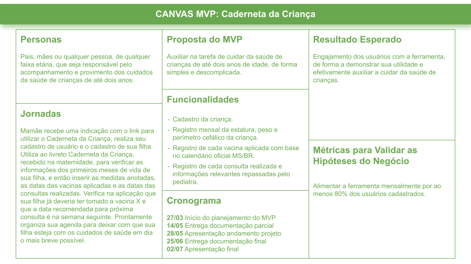

# Documentação e Artefatos

Esse documento tem como objetivo apresentar e descrever o projeto final do Curso Superior de Tecnologia em Sistemas para Internet da Faculdade Senac Porto Alegre, fornecendo resumidamente informações e artefatos sobre a concepção do produto, o seu planejamento, as decisões arquiteturais, desenvolvimento, testes/validação e conclusões.

A documentação completa do projeto está publicada no Medium, acessível pelo primeiro link relacionado abaixo.

## [Medium: Caderneta da Criança](https://medium.com/@grosa.ict/caderneta-da-crianca-b97e5db1cdfe)

## [Canvas MVP](artifacts/Canvas_MVP.png)
<!--  -->

## [Repositório server](https://github.com/grosaict/CDC-server)

## [Repositório web-client](https://github.com/grosaict/CDC-web-client)