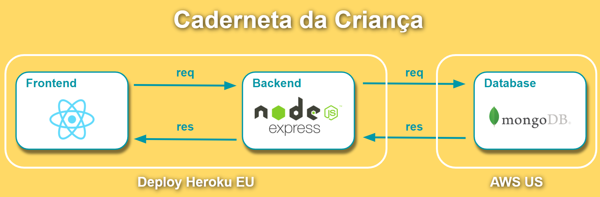

# Arquitetura do sistema

Foi utilizado o [MERN](https://upflow.me/entendendo-o-mern-stack-o-que-e/) como stack base da aplicação, cuja sigla significa as iniciais de [MongoDB](https://www.mongodb.com/), [Express](https://expressjs.com/pt-br/), [React](https://pt-br.reactjs.org/) e [Node](https://nodejs.org/pt-br/about/), nome das quatro tecnologias principais que compõem a pilha.

Essa decisão foi pautada por suportar o desenvolvimento de uma aplicação leve no conceito de página única, do inglês [Single-Page Application (SPA)](https://pt.wikipedia.org/wiki/Aplicativo_de_p%C3%A1gina_%C3%BAnica), modelo arquitetural considerado adequado para o alcance dos objetivos almejados no projeto.

## Modelo base da arquitetura do sistema:

## Arquitetura detalhada do Caderneta da Criança:

### [VOLTAR](https://github.com/grosaict/caderneta-da-crianca)