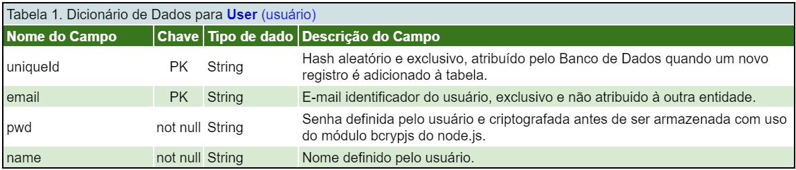
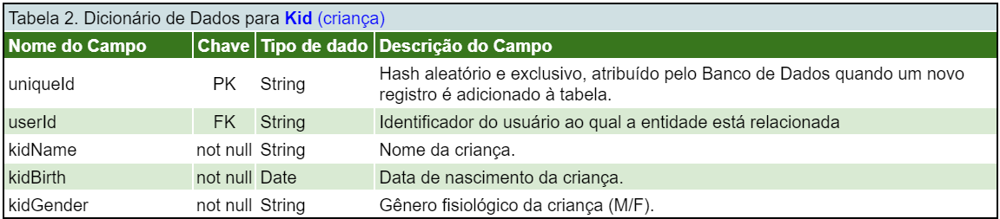
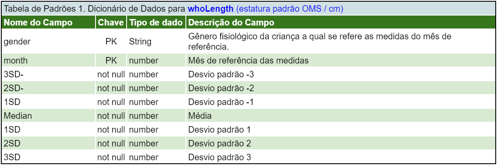
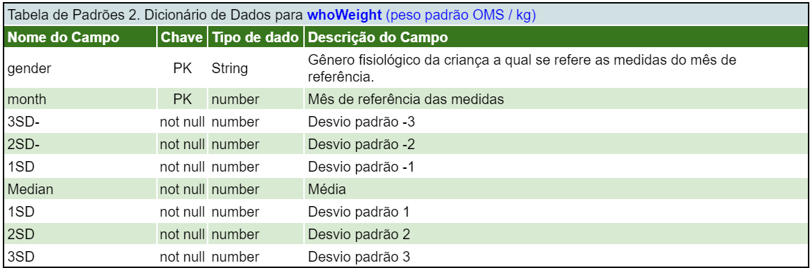
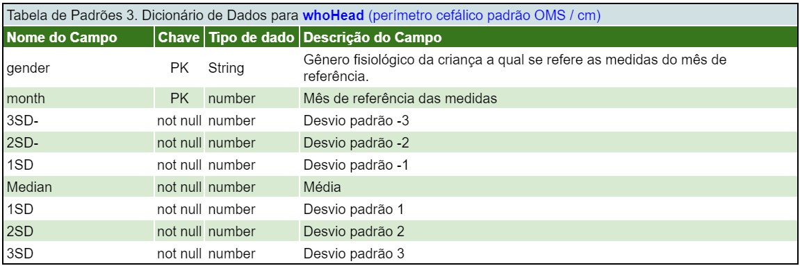
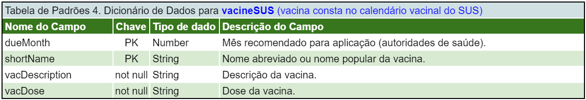
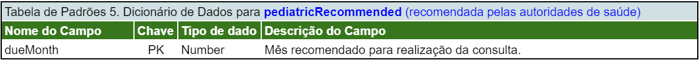

# Dicionário de Dados

## Abaixo o dicionário de dados das tabelas mantidas pelo usuário:

## Abaixo o dicionário de dados das tabelas de padrões que poderão ser mantidas por um administrador do sistema, porém que não foram implementadas no MVP:

### [VOLTAR](https://github.com/grosaict/caderneta-da-crianca)